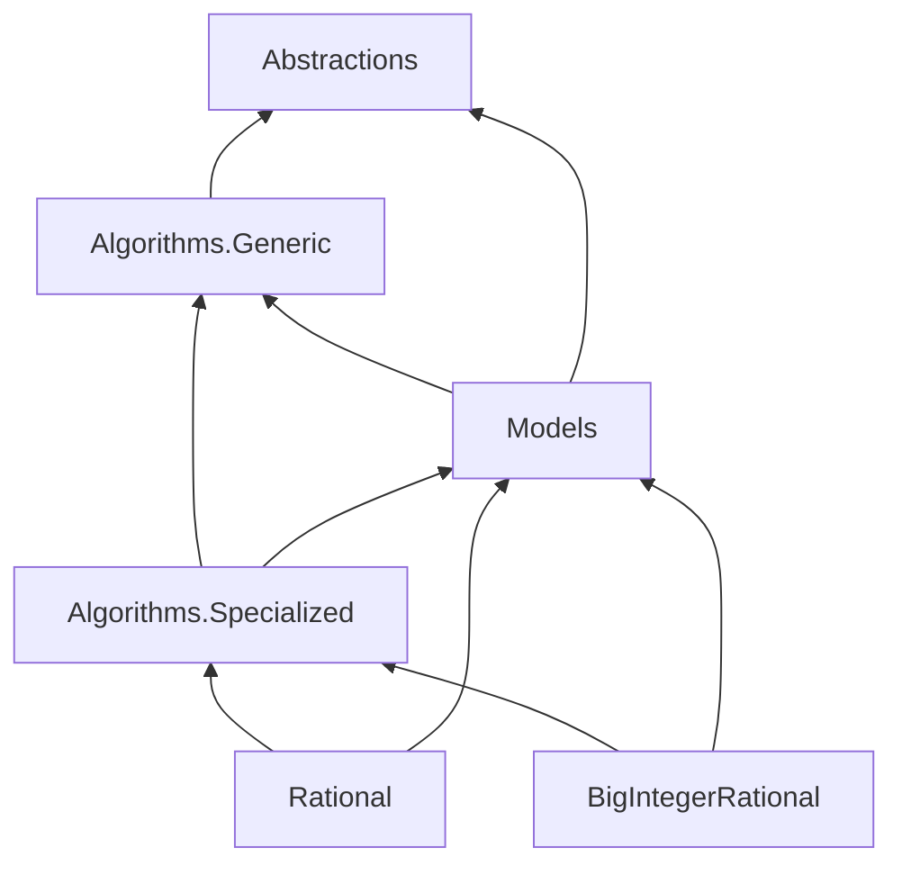

# Ratiocinia

A rational number arithmetic library for .NET using generic math.
Core algorithms are adapted from [Boost.Rational](https://github.com/boostorg/rational).

## Features

- **Generic Math Support**: Works with any `IBinaryInteger<T>` type via `Rational<T>`
- **Arbitrary Precision**: `BigIntegerRational` for unlimited precision arithmetic
- **Policy-Based Design**: Choose between checked and unchecked arithmetic at compile-time
- **Full INumberBase Implementation**: Rationals integrate seamlessly with .NET generic math APIs
- **Automatic Normalization**: All rationals are stored in canonical form (positive denominator, GCD of 1)

## Installation

Install via NuGet:

```bash
# For generic Rational<T> with any IBinaryInteger<T> type
dotnet add package Ratiocinia.Rational

# For arbitrary precision BigIntegerRational
dotnet add package Ratiocinia.BigIntegerRational
```

Or via Package Manager Console:

```powershell
Install-Package Ratiocinia.Rational
Install-Package Ratiocinia.BigIntegerRational
```

## Quick Start

### Using Rational&lt;T&gt;

```csharp
using Ratiocinia.Rational;

// Create rational numbers (automatically normalized)
var half = Rational.Create(1, 2);
var third = Rational.Create(1, 3);

// Arithmetic operations
var sum = half + third;        // 5/6
var product = half * third;    // 1/6
var quotient = half / third;   // 3/2

// Checked arithmetic (throws on overflow)
var result = checked(half + third);

// Comparisons
bool isLess = half < third;    // false
bool isEqual = half == half;   // true

// INumberBase methods
bool isInteger = Rational<int>.IsInteger(half);     // false
bool isZero = Rational<int>.IsZero(half);           // false
bool isPositive = Rational<int>.IsPositive(half);   // true
```

### Using BigIntegerRational

```csharp
using Ratiocinia.BigIntegerRational;
using System.Numerics;

// Create from BigInteger values
var large = BigIntegerRational.Create(
    BigInteger.Parse("123456789012345678901234567890", CultureInfo.InvariantCulture),
    BigInteger.Parse("987654321098765432109876543210", CultureInfo.InvariantCulture)
);

// Or from smaller integers
var simple = BigIntegerRational.Create(22, 7);

// Full arithmetic support
var sum = large + simple;
var product = large * simple;
```

## Architecture

Ratiocinia uses a layered architecture with policy-based design.
Project references between packages are:



### Projects

| Project | Description |
|---------|-------------|
| **Ratiocinia.Abstractions** | Pure interfaces for math operations |
| **Ratiocinia.Algorithms.Generic** | Policy-based rational arithmetic algorithms |
| **Ratiocinia.Models** | Checked/unchecked arithmetic policy implementations |
| **Ratiocinia.Algorithms.Specialized** | Convenience wrappers using .NET generic math |
| **Ratiocinia.Rational** | Generic `Rational<T>` struct |
| **Ratiocinia.BigIntegerRational** | Arbitrary precision `BigIntegerRational` struct |

### Design Principles

- **Policy-Based Algorithms**: Core algorithms accept policy parameters implementing operation interfaces.
    This separates algorithms from checked/unchecked arithmetic behavior.

- **Normalization**: Rationals are always stored in normalized form.
    Use `Create()` to auto-normalize or `TryCreate()` to validate pre-normalized values.

- **INumberBase Conformance**: Both rational types fully implement `INumberBase<T>`, enabling use with generic numeric algorithms.

## Building

### Prerequisites

- .NET 10.0 SDK or later (see `global.json`)

### Commands

```bash
# Build entire solution
dotnet build Ratiocinia.sln

# Build in Release mode
dotnet build Ratiocinia.sln -c Release

# Run all tests
dotnet test Ratiocinia.sln

# Run specific test project
dotnet test tests/Tests.Algorithms/Tests.Algorithms.csproj

# Run specific test by name filter
dotnet test tests/Tests.Algorithms/Tests.Algorithms.csproj --filter "FullyQualifiedName~Add_reduces_result"

# Run benchmarks
dotnet run -c Release --project benchmarks/Benchmarks.Algorithms/Benchmarks.Algorithms.csproj
```

## Requirements

- **.NET 7.0+** for `Rational<T>`, `BigIntegerRational`, and specialized algorithms
- **.NET Standard 2.0** compatible for abstractions and generic algorithms

## License

This project is licensed under the [MIT License](LICENSE.txt).

## Acknowledgments

- Core algorithms adapted from [Boost.Rational](https://github.com/boostorg/rational) C++ library
